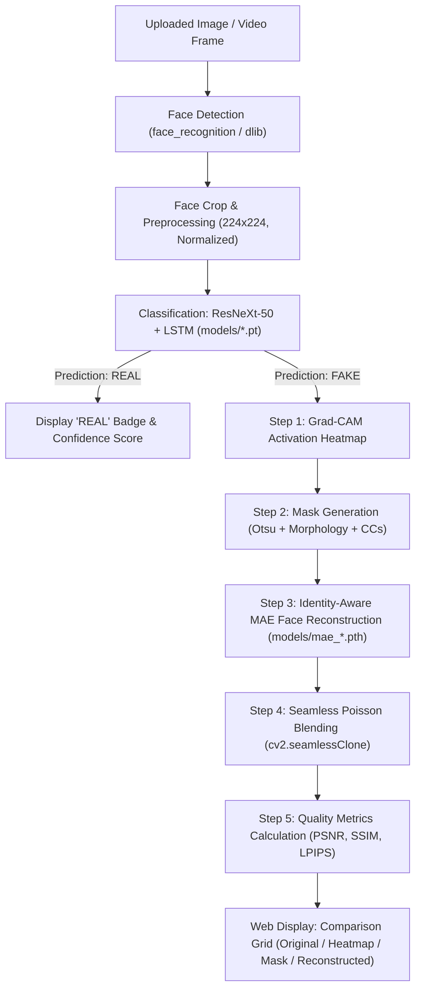

# DeepShield AI — Models & Reconstruction Pipeline Reference (README2)

This document provides a comprehensive technical reference for all **Deepfake Detection Models**, **Reconstruction & Inpainting Models**, their **Python source code implementations**, and their **exact file locations on disk**.

---

## 📑 Table of Contents

1. [Architectural Overview & File Mapping](#1-architectural-overview--file-mapping)
2. [Deepfake Detection Models (Classification)](#2-deepfake-detection-models-classification)
   - [Model Architecture (ResNeXt-50 + LSTM)](#model-architecture-resnext-50--lstm)
   - [Dynamic Model Selection Logic](#dynamic-model-selection-logic)
   - [Detection Model Weights Inventory (.pt)](#detection-model-weights-inventory-pt)
3. [Reconstruction & Inpainting Models](#3-reconstruction--inpainting-models)
   - [Identity-Aware Masked Autoencoder (MAE / DFREC)](#a-identity-aware-masked-autoencoder-mae--dfrec)
   - [Image Manipulation Localization (IML-ViT Checkpoints)](#b-image-manipulation-localization-iml-vit)
   - [Grad-CAM Localization & Mask Generation](#c-grad-cam-localization--mask-generation)
   - [U-Net Inpainting Architecture](#d-u-net-inpainting-architecture)
   - [Poisson Blending & Telea Fallback](#e-poisson-blending--telea-fallback)
   - [Reconstruction Quality Metrics](#f-reconstruction-quality-metrics)
4. [Master Inventory of Weights in `models/`](#4-master-inventory-of-weights-in-models)
5. [End-to-End Pipeline Execution Flow](#5-end-to-end-pipeline-execution-flow)

---

## 1. Architectural Overview & File Mapping

| Category | Model / Component | Implementation File | Execution / Integration File | Model Weights / Files |
| :--- | :--- | :--- | :--- | :--- |
| **Detection** | **ResNeXt-50 (32x4d) + LSTM** | `Django Application/ml_app/views.py` (lines 67–86) | `Django Application/ml_app/views.py` (lines 386–406) | `models/*.pt` (10 models) |
| **Face Alignment** | **dlib HOG / CNN Face Detector** | `face_recognition` library | `Django Application/ml_app/views.py` (line 422) | dlib face landmark weights |
| **Heatmap** | **Grad-CAM Extractor** | `Django Application/reconstruction/gradcam_extractor.py`<br>`deep_pro/reconstruction/gradcam_pipeline.py` | `Django Application/ml_app/views.py` (lines 464–500) | Extracted dynamically from ResNeXt layer |
| **Masking** | **Adaptive Mask Generator (Otsu + Morphology)** | `Django Application/reconstruction/mask_generator.py` | `Django Application/ml_app/views.py` (lines 501–532) | Algorithmic (Morphological + CC) |
| **Reconstruction** | **Identity-Aware MAE (ViT-Base & ViT-Huge)** | `Django Application/reconstruction/mae_modules.py`<br>`deep_pro/reconstruction/mae_modules.py` | `Django Application/ml_app/views.py` (lines 533–567) | `models/mae_*.pth` (4 checkpoints) |
| **Reconstruction** | **IML-ViT Tamper Localization** | Checkpoint weights for CASIAv2 & TruFor | Localization & segmentation workflows | `models/iml-vit_*.pth` (3 checkpoints) |
| **Reconstruction** | **U-Net Inpainter** | `deep_pro/reconstruction/gradcam_pipeline.py` (lines 250–380) | Standalone inpainting pipeline | Code-defined PyTorch model |
| **Blending** | **Poisson Seamless Cloning + Telea Fallback** | `Django Application/reconstruction/blender.py`<br>`Django Application/reconstruction/pipeline.py` | `Django Application/ml_app/views.py` (lines 586–606) | OpenCV `seamlessClone` + `INPAINT_TELEA` |
| **Evaluation** | **Reconstruction Metrics (PSNR / SSIM / LPIPS)** | `Django Application/reconstruction/metrics.py` | `Django Application/ml_app/views.py` (lines 617–648) | PyTorch / scikit-image / LPIPS |

---

## 2. Deepfake Detection Models (Classification)

### Model Architecture (ResNeXt-50 + LSTM)
- **Source File:** `Django Application/ml_app/views.py` (class `Model(nn.Module)`)
- **Backbone:** Pretrained `torchvision.models.resnext50_32x4d` stripped of final pooling and classification layers (`nn.Sequential(*list(model.children())[:-2])`).
- **Sequence Layer:** `nn.LSTM(latent_dim=2048, hidden_dim=2048, num_layers=1, bidirectional=False)`.
- **Classification Head:** `AdaptiveAvgPool2d(1)` -> `Linear(2048, num_classes=2)` with `Dropout(0.4)`.

```python
class Model(nn.Module):
    def __init__(self, num_classes, latent_dim=2048, lstm_layers=1, hidden_dim=2048, bidirectional=False):
        super(Model, self).__init__()
        model = models.resnext50_32x4d(pretrained=True)
        self.model = nn.Sequential(*list(model.children())[:-2])
        self.lstm = nn.LSTM(latent_dim, hidden_dim, lstm_layers, bidirectional)
        self.relu = nn.LeakyReLU()
        self.dp = nn.Dropout(0.4)
        self.linear1 = nn.Linear(2048, num_classes)
        self.avgpool = nn.AdaptiveAvgPool2d(1)
```

### Dynamic Model Selection Logic
- **Function:** `get_accurate_model(sequence_length)` in `Django Application/ml_app/views.py` (lines 210–239).
- Inspects the `models/` directory for `.pt` files matching the requested video frame sequence length (e.g., 10, 20, 40, 60, 80, 100 frames).
- If multiple candidates exist for the same sequence length, it automatically picks the model with the highest reported validation accuracy.

### Detection Model Weights Inventory (.pt)
**Directory Location:**
`Django Application/models/`

| Filename | Sequence Length | Dataset / Accuracy | File Size |
| :--- | :--- | :--- | :--- |
| `model_84_acc_10_frames_final_data.pt` | 10 frames | Final Combined Dataset (84% Acc) | ~216 MB (226,547,517 B) |
| `model_87_acc_20_frames_final_data.pt` | 20 frames | Final Combined Dataset (87% Acc) | ~216 MB (226,547,455 B) |
| `model_89_acc_40_frames_final_data.pt` | 40 frames | Final Combined Dataset (89% Acc) | ~216 MB (226,547,489 B) |
| `model_90_acc_20_frames_FF_data.pt` | 20 frames | FaceForensics++ (90% Acc) | ~216 MB (226,547,581 B) |
| `model_90_acc_60_frames_final_data.pt` | 60 frames | Final Combined Dataset (90% Acc) | ~216 MB (226,547,597 B) |
| `model_93_acc_100_frames_celeb_FF_data.pt` | 100 frames | Celeb-DF + FF++ (93% Acc) | ~216 MB (226,547,636 B) |
| `model_95_acc_40_frames_FF_data.pt` | 40 frames | FaceForensics++ (95% Acc) | ~216 MB (226,547,587 B) |
| `model_97_acc_60_frames_FF_data.pt` | 60 frames | FaceForensics++ (97% Acc) | ~216 MB (226,547,511 B) |
| `model_97_acc_80_frames_FF_data.pt` | 80 frames | FaceForensics++ (97% Acc) | ~216 MB (226,547,497 B) |
| `model_97_acc_100_frames_FF_data.pt` | 100 frames | FaceForensics++ (97% Acc) | ~216 MB (226,547,531 B) |

---

## 3. Reconstruction & Inpainting Models

When a frame is detected as **FAKE**, the restoration pipeline activates to reconstruct the authentic underlying face.

### A. Identity-Aware Masked Autoencoder (MAE / DFREC)
- **Primary Source Files:**
  1. `Django Application/reconstruction/mae_modules.py` (defines `MAEFaceReconstruction` and `IdentityLoss`)
  2. `deep_pro/reconstruction/mae_modules.py` (full DFREC architecture: `IdentityAwareMasking`, `SIRMEncoder`, `TIRMDecoder`, `PatchEmbedding`, `MAEFaceReconstruction`)
- **Reference:** *DFREC: DeepFake Identity Recovery Based on Identity-aware Masked Autoencoder* (arXiv:2412.07260v2).
- **Functionality:** Discards manipulated facial patches while encoding authentic identity features via Vision Transformer (ViT). A target-identity-guided decoder reconstructs the missing facial regions.
- **Candidate Pretrained Weights (searched automatically by `ml_app/views.py`):**
  - `mae_face_visualize_vit_base.pth` (447 MB) — Face-specialized ViT-Base visualization checkpoint
  - `mae_face_pretrain_vit_base.pth` (447 MB) — Face-specialized ViT-Base pretraining checkpoint
  - `mae_pretrain_vit_base.pth` (343 MB) — Standard ImageNet ViT-Base checkpoint
  - `mae_pretrain_vit_huge.pth` (2.52 GB) — Large ViT-Huge checkpoint

### B. Image Manipulation Localization (IML-ViT)
- **Pretrained Checkpoint Files:**
  - `iml-vit_checkpoint.pth` (367 MB)
  - `iml-vit_checkpoint_casiav2_20231014.pth` (367 MB) — Trained on CASIAv2 manipulation dataset
  - `iml-vit_checkpoint_trufor_20231104.pth` (367 MB) — Trained on TruFor forgery dataset
- **Role:** High-precision localization of copy-move, splicing, and face-swap boundaries.

### C. Grad-CAM Localization & Mask Generation
- **Grad-CAM Extractor File:** `Django Application/reconstruction/gradcam_extractor.py` (class `GradCAMExtractor`)
  - Calculates class activation heatmaps from the last convolutional feature maps (`fmap`) and classification weights (`weight_softmax`).
- **Mask Generator File:** `Django Application/reconstruction/mask_generator.py` (class `MaskGenerator`)
  - `to_binary(heatmap, method='otsu', ...)`: Applies Gaussian blurring and Otsu thresholding.
  - Connected component analysis removes spurious background speckles (`min_component_ratio=0.005`).
  - `expand_mask(..., border_px=5)`: Dilates the boundary to encompass blending seams.
  - `to_soft_mask(..., blur_kernel=15, blur_sigma=5.0)`: Creates a continuous $[0, 1]$ alpha channel for blending.

### D. U-Net Inpainting Architecture
- **Source File:** `deep_pro/reconstruction/gradcam_pipeline.py` (lines 250–380)
- **Structure:**
  - Encoder: 4 downsampling stages with `DoubleConv` + `MaxPool2d`.
  - Decoder: 4 upsampling stages with bilinear upsampling / transpose conv + skip connections (`torch.cat`).
  - Output: 3-channel RGB restored image.

### E. Poisson Blending & Telea Fallback
- **Source File:** `Django Application/reconstruction/blender.py` (class `Blender`)
- **Poisson Seamless Cloning:**
  - Uses `cv2.seamlessClone(src, dst, mask, center, cv2.NORMAL_CLONE)` to match gradient fields, removing visible seam lines around reconstructed facial features.
- **Fallback Inpainting:**
  - If MAE weights produce high gradient noise (`grad_score > 0.15`), the system automatically engages Fast Marching Telea inpainting (`cv2.inpaint(..., 3, cv2.INPAINT_TELEA)`).

### F. Reconstruction Quality Metrics
- **Source File:** `Django Application/reconstruction/metrics.py` (classes `ReconstructionMetrics`, `LPIPSEvaluator`)
- **Metrics Evaluated:**
  - **PSNR (Full Image & Masked Region):** Measures pixel reconstruction fidelity in decibels (dB).
  - **SSIM (Full Image & Masked Region):** Measures perceptual structural similarity $[-1, 1]$.
  - **LPIPS:** Deep perceptual similarity via VGG/AlexNet feature embeddings.

---

## 4. Master Inventory of Weights in `models/`

All pre-trained weights reside in:  
**`Django Application/models/`**  
*(Absolute Path: `D:\Atharvac++\deep_next\deep_pro\deepfake_vid\Deepfake_detection_using_deep_learning-master\Django Application\models\`)*

```
Django Application/models/
├── iml-vit_checkpoint.pth                     (367.1 MB)  ← IML-ViT Localization
├── iml-vit_checkpoint_casiav2_20231014.pth     (367.1 MB)  ← IML-ViT CASIAv2
├── iml-vit_checkpoint_trufor_20231104.pth      (367.1 MB)  ← IML-ViT TruFor
├── mae_face_pretrain_vit_base.pth             (447.7 MB)  ← MAE Face Pretrained (ViT-Base)
├── mae_face_visualize_vit_base.pth            (447.7 MB)  ← MAE Face Visualize (ViT-Base)
├── mae_pretrain_vit_base.pth                  (343.2 MB)  ← MAE ViT-Base Pretrained
├── mae_pretrain_vit_huge.pth                  (2,523.2 MB)← MAE ViT-Huge Pretrained
├── model_84_acc_10_frames_final_data.pt       (226.5 MB)  ← ResNeXt50+LSTM (10 Frames)
├── model_87_acc_20_frames_final_data.pt       (226.5 MB)  ← ResNeXt50+LSTM (20 Frames)
├── model_89_acc_40_frames_final_data.pt       (226.5 MB)  ← ResNeXt50+LSTM (40 Frames)
├── model_90_acc_20_frames_FF_data.pt          (226.5 MB)  ← ResNeXt50+LSTM (20 Frames, FF++)
├── model_90_acc_60_frames_final_data.pt       (226.5 MB)  ← ResNeXt50+LSTM (60 Frames)
├── model_93_acc_100_frames_celeb_FF_data.pt   (226.5 MB)  ← ResNeXt50+LSTM (100 Frames, Celeb)
├── model_95_acc_40_frames_FF_data.pt          (226.5 MB)  ← ResNeXt50+LSTM (40 Frames, FF++)
├── model_97_acc_60_frames_FF_data.pt          (226.5 MB)  ← ResNeXt50+LSTM (60 Frames, FF++)
├── model_97_acc_80_frames_FF_data.pt          (226.5 MB)  ← ResNeXt50+LSTM (80 Frames, FF++)
└── model_97_acc_100_frames_FF_data.pt         (226.5 MB)  ← ResNeXt50+LSTM (100 Frames, FF++)
```

---

## 5. End-to-End Pipeline Execution Flow


